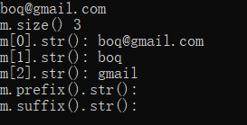
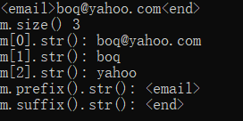
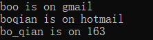

# C++正则

## 总述

正则是一种规则，它用来匹配（进而捕获、替换）字符串。这种规则需要“模式”、“字符串”这两样东西，“模式”根据正则规则，来处理“字符串”。

这种规则被许多语言支持，C++11以后才支持正则。

C++11支持的正则和其他语言支持的正则有区别，本篇记录的目的不在于讲解正则，也不在于阐述C++11支持的正则详细是什么，而是只记下常见的、够用的正则规则（**以供速查**，应有不严谨之处）及使用用法。

## ECMAScript支持的正则

正则由元字符和普通字符组成。普通字符就代表它原本的含义；元字符的意义不同于该字符本来的含义，而是有特殊的意义和功能。

根据其意义功能划分，可将元字符划分为：

#### 具有特殊意义的元字符  

`\`：`\字符`能够改变`字符`原本的含义 

`^`：`^字符`指示字符串的头，且要求字符串以`字符`开头，不占位。`\^`表示一个真正的^符号。  

`$`：`$字符`指示字符串的尾，且要求字符串以`字符`结尾，不占位。`\$`表示一个真正的$符号。  

`、()`：分组，大正则中包含小正则。可以改变默认的优先级。在模式中可以使用`\1`来表示第一组已然捕获到的东西。

`\b`：指示字符串的边界（头/尾/空格左/空格右），`字符\b`要求边界的左边是`字符`，`\b字符`要求边界的右边是`字符`。  

`.`：表示一个除了`\n`以外的任意一个字符。`\.`表示一个真正的.符号。 

`|`：`字符串1|字符串2`表示一个**字符串**，该字符串是字符串1、字符串2中的一个。`|`在正则中的优先级比较混乱，所以建议加上足够多的括号来分组。

`[]`：`[字符1字符2字符3...]`表示一个字符，该字符是字符1、字符2、字符3……中的某一个。中括号中出现的所有字符都是代表本身意思的字符（没有特殊含义），如`[.]`只能匹配`.`符号，而不能匹配任意符号。  

`[^字符1字符2字符3...]`表示一个字符，该字符不是字符1、字符2、字符3……中的任何一个  

`[a-z]`表示一个字符，该字符是a、b、c……z中的某一个  

`[^a-z]`表示一个字符，该字符不是a、b、c……z中的任何一个   

`\w`：表示一个字符，该字符是数字、字母、下划线中的某一个。等价于`[(0-9)(a-z)(A-Z)(_)]`    

`\W`：表示一个字符，该字符不是数字、字母、下划线中的任何一个。等价于[]  

`\d`表示一个字符，该字符是0、1、2……9中的某一个  

`\D`表示一个字符，该字符不是0、1、2……9中的任何一个  

`\s`表示一个字符，该字符是空白符（空格、制表符、换页符）2、代表出现次数的

#### 量词元字符  

 `*`：`字符*`要求`字符`出现0到多次

 `+`：`字符+`要求`字符`出现1到多次

 `?`：`字符?`要求`字符`出现0次或1次

 `{n}`：`字符{n}`要求`字符`出现n次

 `{n,}`：`字符{n,}`要求`字符`出现n到多次

 `{n,m}`：`字符{n,m}`要求`字符`出现n到m次、

## C++支持的正则

C++可以支持ECMAScript支持的正则，也可以支持grep支持的正则等等。

由于我本人较熟悉ECMAScript支持的正则，且C++默认支持的即是它，所以我接下来讲的也是这种正则。

首先要举一个例子解释一下，

```C++
/**在ECMAScript中写一个匹配11位电话号码的正则模式是这样写的**/
var r = /\d{1, 11}/;
/**在C++中写一个匹配11位电话号码的正则模式是这样写的**/
regex r("\\d{1, 11}")
```

看似不一样，其实是一样的，因为传递给regex构造函数的参数是一个字符串，该字符串被C++编译器解析时，将`\\`解释为真正的`\`（由于C++中的字符`\`是转义字符），解析出来的`\`和紧随其后的`d`组合，形成了真正的`\d`，表示一个数字字符。

所以含有`\`的元字符，在C++定义时，都要写成`\\`。

## C++使用正则

### 匹配与否

头文件`<regex>`中的`regex_match`和`regex_search`均可以进行匹配，返回一个布尔类型，匹配成功为true，匹配失败为false。

**不同点：**前者要求完全匹配，后者要求子串匹配即可；

下面以`regex_match`为例，`regex_search`的写法与之相同，故不赘述。

```c++
string str = "hhh233";
regex r("[a-z0-9]+");

// 用法一
bool flag = regex_match(str,r);
// 用法二
bool flag = regex_match(str,regex("\\d+"));
// 用法三
bool flag = regex_match(str.begin()+7,str.end(),regex("\\d+"));
```

### 捕获

捕获就是先匹配，然后将匹配结果存储下来。捕获同样是使用上面介绍的那两个函数，仍然区分为整串匹配和子串匹配。

**捕获的步骤：**

1. 模式中一般要有分组（因为捕捉的正是分组匹配的结果）
2. 定义一个STL容器smatch，用来保存捕捉的结果
3. 使用`reg_search`函数匹配，用`smatch`的实例存储匹配的结果，即完成捕捉。
4. 使用`m.size()`，查看捕捉到的个数；使用`m.str(i)`，查看捕捉到的字符串；【注意：`m.str(0)`一定是整个正则匹配到的部分，`m.str(1)`及以后才是分组捕获的结果】
5. `m.prefix().str()`获取整个匹配之前的字符串；`m.suffix().str()`获取整个匹配之后的字符串

**代码：**

```c++
#include <bits/stdc++.h>
using namespace std;
int main()
{
    string str;
    while(true){
        cin >> str;
        regex e("([[:w:]]+)@([[:w:]]+)\.com");
        smatch m;
        bool found = regex_search(str, m, e);
        if(found)
        {
            cout << "m.size() " << m.size() << endl;
            for(int i=0; i<m.size(); ++i){
                cout << "m.str(" << i << "): " << m.str(i) << endl;
            }
            cout << "m.prefix().str(): " << m.prefix().str() << endl;
            cout << "m.suffix().str(): " << m.suffix().str() << endl;
        }
        else cout << "Not Found" << endl;
        return 0;
        
        
    }
}
```

结果为：





**补充：**

1. 获取第i个匹配`m.str(i)`，还有其他等价写法：`m[i].str()`、`*(m.begin() + i)`
2. 模式其实可以不分组...这样就只有`m.str(0)`捕捉到整个串，没有`m.str(1)`其他的了。

#### 更高级的捕捉

由于**`regex_replace`方法只能捕捉到第一个匹配**，想要捕捉到每一个匹配，以及匹配内的分组，需要使用另外一种方法：

**步骤：**

1. 正则内有分组
2. 定义迭代器的同时初始化迭代器，使其指向一个`smatch`实例的数组。
3. 定义`end`，标志`smatch`实例的数组的末尾
4. 使用迭代器遍历数组

**代码：**

```C++
#include <bits/stdc++.h>
using namespace std;
int main()
{
    string str = "boo@gmail.com  boqian@hotmail.com bo_qian@163.com";
    regex e("([[:w:]]+)@([[:w:]]+)\.com");
    sregex_iterator pos(str.cbegin(), str.cend(), e);
    sregex_iterator end;
    
    for(; pos!=end; ++pos)
    {
        cout << "Matched: " << pos->str(0) << endl;
        cout << "user name: " << pos->str(1) << endl;
        cout << "domain: " << pos->str(2) << endl;
        cout << endl;
    }
    return 0;
}
```

**补充：**

1. 同上，模式中也可以没有分组，这样也就没有`pos->str(1)`其他的了。

2. 还有一种更高级的捕捉，能够实现一模一样的功能，只是对捕获的结果的组织顺序不相同，它将所有与第一个分组匹配的结果，放在一个容器内。

   运行如下代码，感受一下：

   ```C++
   #include <bits/stdc++.h>
   using namespace std;
   int main()
   {
       string str = "boo@gmail.com  boqian@hotmail.com bo_qian@163.com";
       regex e("([[:w:]]+)@([[:w:]]+)\.com");
       sregex_token_iterator pos(str.cbegin(), str.cend(), e, 1);// 表示第一个分组，再换成0、2、-1感受一下
       sregex_token_iterator end;
       
       for(; pos!=end; ++pos)
       {
           cout << "Matched: " << pos->str() << endl;
           cout << endl;
       }
       return 0;
   }
   ```

   

### 捕捉的同时生成新串

`regex_replace`方法先完成捕捉，得到类似于：

大匹配1：分组1、分组2
大匹配2：分组1、分组2
大匹配3：分组1、分组2
...

所以如下代码：

```c++
#include <bits/stdc++.h>
using namespace std;
int main()
{
    string str = "boo@gmail.com  boqian@hotmail.com bo_qian@163.com";
    regex e("([[:w:]]+)@([[:w:]]+)\.com");
    cout << regex_replace(str, e, "$1 is on $2\n", regex_constants::format_no_copy); // 除了捕捉到的组以外，其他的东西均舍弃
    return 0;
}
```

运行结果：



**补充：**

1. `regex_replace`除了`regex_constants::format_no_copy`以外，还有其他flag，如`regex_constants::format_first_only`表示只取“大匹配1”，而忽略其他。
2. flag和flag之间通过`|`相连接。
3. `regex_match`和`regex_search`也有自己的flag，如用于忽略英文字母大小写的`regex_constants::icase`