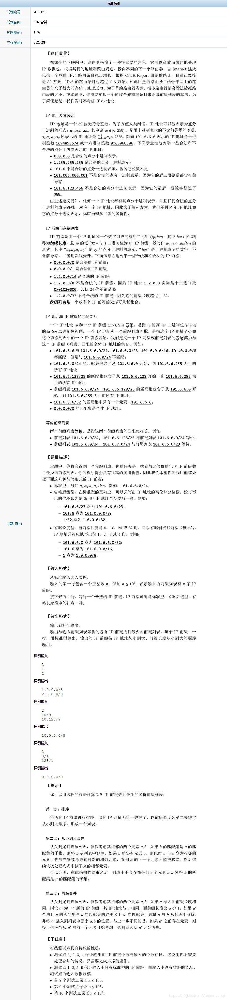
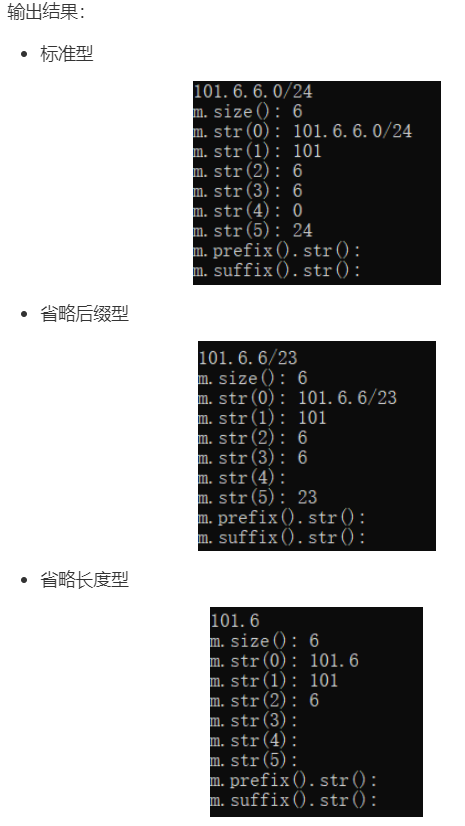

# 总述

在理解题意的基础上，题目最后已经给了提示。按照提示的步骤解题即可。

问题的麻烦之处在于：

- 发现b是a的匹配集的充要条件
- 发现a、b可合并为a'的充要条件
- 如何处理、存储输入

前两个问题的答案是固定的；最后一个问题的答案则多种多样，不同的答案决定了其他部分的代码实现，对程序的运行效率有很大影响。

解决麻烦、代码实现还需要扎实的C++基础、以及一些C++高级知识。

最后是效率问题，60分是因为超时了0.062秒（规定时间是1秒）……

题解详见注释。

# 60分题解

## 分析

1. 由于题目需要频繁地删除元素，应当使用list容器；
   对list容器进行题目要求的排序操作，不能够使用头文件algorithm中的sort()函数，因为**该sort函数仅支持数组、vector、string、deque**，需要使用list容器封装的sort函数，具体使用方法见代码。
2. `IPel`存储ip和它的前缀长度，list实例`IPlist`的每一个元素都是`IPel`的实例。
   `IPel`中的ip是`unsigned`类型，这是考虑到，`unsigned`类型数据的移位运算、与运算的时间代价少，而实现题目中的判断子集等操作，其实都可以通过移位实现，详见代码。

2. 该题解使用C++中的正则来处理所有不同的ip前缀类型（标准型、省略后缀型、省略长度型），下面是一段代码片段，来演示正则在本题中的作用，请读者自行运行：

   ```C++
   #include <bits/stdc++.h>
   using namespace std;
   int main()
   {
       string str;
       regex e("(\\d+)\\.?(\\d+)?\\.?(\\d+)?\\.?(\\d+)?/?(\\d+)?");
       smatch m;
       bool matched;
       while(true)
       {
           cin >> str;
           matched = regex_match(str, m, e);
           if(matched)
           {
               printf("m.size(): %d\n", m.size());
               for(int i=0; i<int(m.size()); ++i){
                   cout << "m.str(" << i << "): " << m.str(i) << endl;
               }
               cout << "m.prefix().str(): " << m.prefix().str() << endl;
               cout << "m.suffix().str(): " << m.suffix().str() << endl;
           }
   
           else
               printf("not match\n");
   
           printf("\n");
       }
       return 0;
   }
   ```

   

   具体的C++正则表达式的学习，请移步我记录的C++知识。

## 代码

```C++
#include <bits/stdc++.h>
using namespace std;
struct IPel // IPelement
{
    unsigned ip=0;
    int len;
};
list<IPel> IPlist;
void createIPel(IPel &ipel)
{
    string ipPre; //ip_prefix
    cin >> ipPre;
    regex r("(\\d+)\\.?(\\d+)?\\.?(\\d+)?\\.?(\\d+)?/?(\\d+)?");
    smatch m;
    regex_match(ipPre, m, r);

    int slen=1;
    // slen，segement_length
    // 当输入的ip前缀没有指明长度时，即省略长度型，以slen*8作为ip前缀的长度
    // 初始化为1，表示ip起码得有一段，比如输入是“0”，ip地址的段长也得是1
    unsigned tmp;
    for(int i=1; i<=4; ++i) // 遍历段
    {
        if(m.str(i) != "") // 如果该段有值
        {
            sscanf(m.str(i).c_str(), "%d", &tmp);
            if(tmp) // 如果tmp是0，就没必要移位、加上了
            {
                tmp = tmp << (4-i)*8; // 左移正确位数
                ipel.ip += tmp; // ipel.ip已初始化为0
            }
            slen = i; // 更新slen
        }
        // 如果该段没有值，依据题意，该段为0
        // （续）也没有必要移位、加上了
    }
    if(m.str(5) == "")
        ipel.len = slen*8;
    else
        sscanf(m.str(5).c_str(), "%d", &ipel.len);
}

//根据题意b的匹配集为a的匹配集的子集等价于
//a的前缀长度不大于b的且a和b的ip地址的前a.len位完全相同
bool bsubseta(IPel &a, IPel &b)
{
    if(a.len > b.len)
        return false;
    if(a.ip^b.ip >> (32-a.len))
        return false;
    return true;

}

//根据题意a、b可合并为a`等价于
//a与b前缀长度相同且二者的前len位中只有最后一位不相同
bool aunionb(IPel &a, IPel &b)
{
    if(a.len != b.len)
        return false;
    return ((a.ip^b.ip) >> (32-a.len)) == 1u;
}
int main()
{
    int N;
    scanf("%d", &N);

    /**读入数据并初始化IPlist**/
    while(N--)
    {
        IPel ipel;
        createIPel(ipel);
        IPlist.push_back(ipel);
    }

    /**IPlist排序**/
    IPlist.sort([](const IPel &a, const IPel &b){
        if(a.ip != b.ip)
            return a.ip < b.ip;
        else
            return a.len < b.len;
    });

    /**IPlist从小到大合并**/
    auto i = IPlist.begin(), j = i;
    ++j;
    while(j != IPlist.end())
    {
        if(bsubseta(*i, *j))
            j = IPlist.erase(j);
        else{
            ++i;
            ++j;
        }
    }

    /**IPlist同级合并**/
    i = IPlist.begin();
    j = i;
    ++j;
    while(j != IPlist.end())
    {
        if(aunionb(*i, *j))
        {
            j = IPlist.erase(j); // 删除b
            --((*i).len); // 删除a，并插入a'
            if(i != IPlist.begin()){ // 如果i前面还有元素
                --i;
                --j;
            }
        }
        else{
            ++i;
            ++j;
        }
    }


    /**打印输出**/
    for(auto &e: IPlist)
    {
        const unsigned a=0xff000000, b=0x00ff0000, c=0x0000ff00, d=0x000000ff;
        printf("%d.%d.%d.%d/%d\n", ((e.ip&a) >> 24), ((e.ip&b) >> 16), ((e.ip&c) >> 8), (e.ip&d), e.len);

    }

    return 0;
}
```

